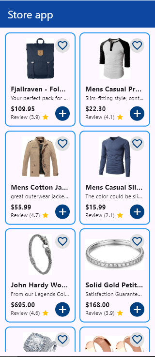

# 🛍️ Store App

A modern Flutter e-commerce application that displays products from an external API with a clean, responsive UI. Built using Clean Architecture principles and modern Flutter development practices.


## 📱 Screenshots



## 🚀 Features

- **Product Catalog**: Browse products in a beautiful grid layout
- **Real-time Data**: Fetches products from FakeStore API
- **Clean Architecture**: Follows Clean Architecture principles with proper separation of concerns
- **State Management**: Uses BLoC pattern for efficient state management
- **Responsive Design**: Optimized for different screen sizes
- **Error Handling**: Comprehensive error handling with custom exceptions
- **Loading States**: Smooth loading indicators and state management
- **Product Details**: Display product information including title, price, description, rating, and images
- **Interactive UI**: Favorite and add to cart buttons (UI ready for future functionality)

## 🛠️ Tech Stack

- **Framework**: Flutter 3.8.0+
- **Language**: Dart
- **State Management**: Flutter BLoC
- **HTTP Client**: Dio
- **Dependency Injection**: GetIt
- **Functional Programming**: Dartz
- **Architecture**: Clean Architecture
- **Testing**: Flutter Test

## 📦 Dependencies

```yaml
dependencies:
  flutter_bloc: ^8.1.3
  dio: ^5.3.2
  equatable: ^2.0.5
  get_it: ^7.6.4
  dartz: ^0.10.1
  cupertino_icons: ^1.0.8
```

## 🏗️ Project Structure

```
lib/
├── core/
│   └── error/
│       ├── exceptions.dart
│       ├── failures.dart
│       └── services/
│           └── services_locator.dart
├── features/
│   └── products/
│       ├── data/
│       │   ├── data_source/
│       │   │   └── products_data_source.dart
│       │   ├── models/
│       │   │   └── product_model.dart
│       │   └── repositories/
│       │       └── products_repository_impl.dart
│       ├── domain/
│       │   ├── entities/
│       │   │   └── product.dart
│       │   ├── repositories/
│       │   │   └── products_repository.dart
│       │   └── use_cases/
│       │       └── get_products_use_case.dart
│       └── presentation/
│           ├── viewmodels/
│           │   ├── cubit/
│           │   │   ├── products_cubit.dart
│           │   │   └── products_state.dart
│           │   └── products_view_model.dart
│           └── views/
│               ├── screens/
│               │   ├── home_screen.dart
│               │   ├── product_list_screen.dart
│               │   └── product_details_screen.dart
│               └── widgets/
│                   └── product_card.dart
└── main.dart
```

## 🚀 Installation Instructions

### Prerequisites

- Flutter SDK (3.8.0 or higher)
- Dart SDK
- Android Studio / VS Code
- Git

### Step-by-Step Setup

1. **Clone the repository**
   ```bash
   git clone https://github.com/yourusername/store_app.git
   cd store_app
   ```

2. **Install dependencies**
   ```bash
   flutter pub get
   ```

3. **Run the application**
   ```bash
   flutter run
   ```

### Platform-Specific Setup

#### Android
```bash
flutter run -d android
```

#### iOS
```bash
flutter run -d ios
```

#### Web
```bash
flutter run -d web
```

## 💻 Usage Examples

### Running the App
```bash
# Run on connected device
flutter run

# Run on specific device
flutter run -d <device_id>

# Run in debug mode
flutter run --debug

# Run in release mode
flutter run --release
```

### Building the App
```bash
# Build APK for Android
flutter build apk

# Build APK Bundle for Play Store
flutter build appbundle

# Build for iOS
flutter build ios

# Build for Web
flutter build web
```

### Testing
```bash
# Run unit tests
flutter test

# Run integration tests
flutter test integration_test/
```

## 🏛️ Architecture

This project follows **Clean Architecture** principles:

- **Presentation Layer**: UI components, BLoC state management
- **Domain Layer**: Business logic, entities, use cases
- **Data Layer**: API calls, data models, repositories

### Key Components

- **BLoC Pattern**: For state management and business logic separation
- **Repository Pattern**: For data abstraction
- **Dependency Injection**: Using GetIt for service location
- **Error Handling**: Custom exceptions and failure classes

## 🧪 Testing

The project includes comprehensive testing:

```bash
# Run all tests
flutter test

# Run tests with coverage
flutter test --coverage

# Run specific test file
flutter test test/widget_test.dart
```

## 📱 Supported Platforms

- ✅ Android
- ✅ iOS
- ✅ Web
- ✅ Windows
- ✅ macOS
- ✅ Linux

## 🤝 Contributing

We welcome contributions! Please follow these steps:

1. **Fork the repository**
2. **Create a feature branch**
   ```bash
   git checkout -b feature/amazing-feature
   ```
3. **Commit your changes**
   ```bash
   git commit -m 'Add some amazing feature'
   ```
4. **Push to the branch**
   ```bash
   git push origin feature/amazing-feature
   ```
5. **Open a Pull Request**

### Contribution Guidelines

- Follow the existing code style
- Write tests for new features
- Update documentation as needed
- Ensure all tests pass before submitting

## 📄 License

This project is licensed under the MIT License - see the [LICENSE](LICENSE) file for details.

## 👨‍💻 Author

**Ahmed Nasser**
- GitHub: [@ahmednasser](https://github.com/ahmednasser)
- Email: your.email@example.com

## 🙏 Acknowledgments

- [FakeStore API](https://fakestoreapi.com/) for providing the product data
- Flutter team for the amazing framework
- The open-source community for the excellent packages

## 📞 Support

If you have any questions or need help, please:

1. Check the [Issues](https://github.com/yourusername/store_app/issues) page
2. Create a new issue if your problem isn't already addressed
3. Contact the maintainer directly

---

⭐ **Star this repository if you found it helpful!**